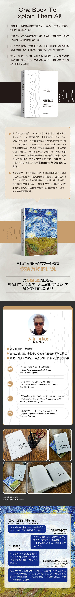

## 读书会 | 预测算法：具身智能如何应对不确定性

Edit: Hao ZHAn

2021/1/5

本次读书会所使用的主要文本是 Andy Clark 的 Surfing Uncertainty 一书（中文译本为《预测算法：具身智能如何因对不确定性》）。在这部开创性的著作中，认知科学家安迪·克拉克（Andy Clark）从几个领域人手，揭示了大脑作为预测推理引擎这一现实——高级生物已演化成为善于预测传人感知刺激流的复杂装置，这些预测会引发行动，构建我们的世界，并改变有待理解和预测之物。

### 关于 Andy Clark

安迪·克拉克（Andy Clark）认知科学家、哲学家，苏格兰爱丁堡大学哲学、心理学和语言科学学院教授。研究方向含人工智能、具身认知、机器入学和预测心智。

### 关于读书会

读书会由 Datawhale 成员 Hao ZHAN 发起。

读书会公众号：Datawhale

读书会视频地址：https://space.bilibili.com/431850986

### 学习形式

采用线上学习的形式（微信群+飞书），每周阅读《预测算法》的一章内容。每周先由领读人梳理章节内容（30-40分钟），然后大家对阅读时所遇到的问题和难点进行讨论（40-80分钟）

每次读书会的内容会以文本和视频的形式发布在该项目中，方便没能参与到讨论中的朋友观看。

### 参与方法

添加微信号：augur1104，并备注 “预测算法”。我们会尽快进行核实，并拉您进读书会讨论群。

